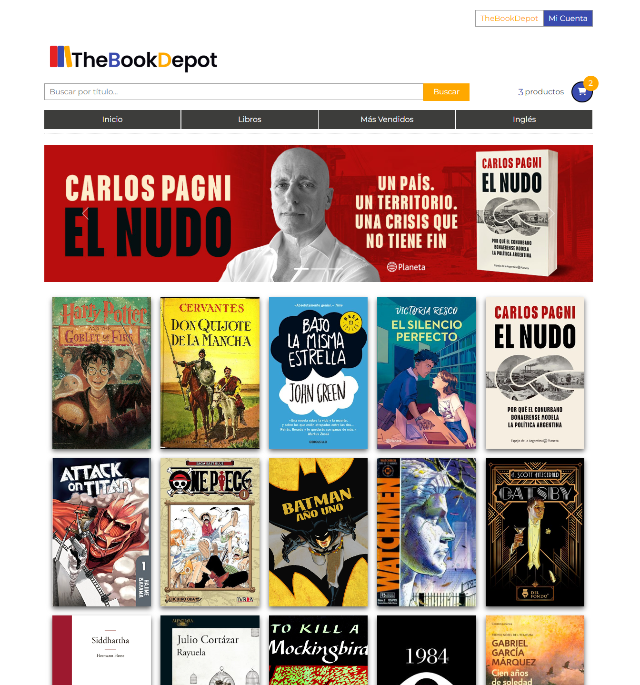
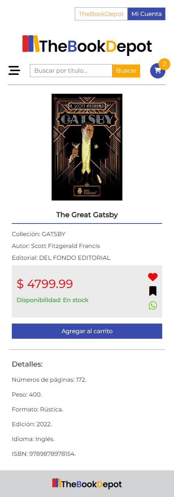
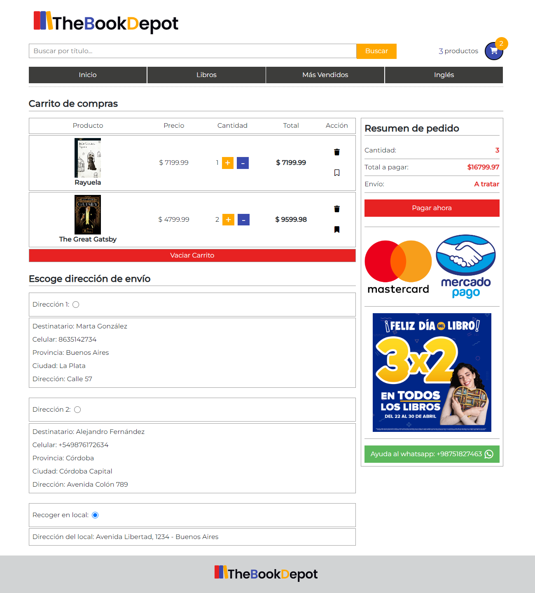
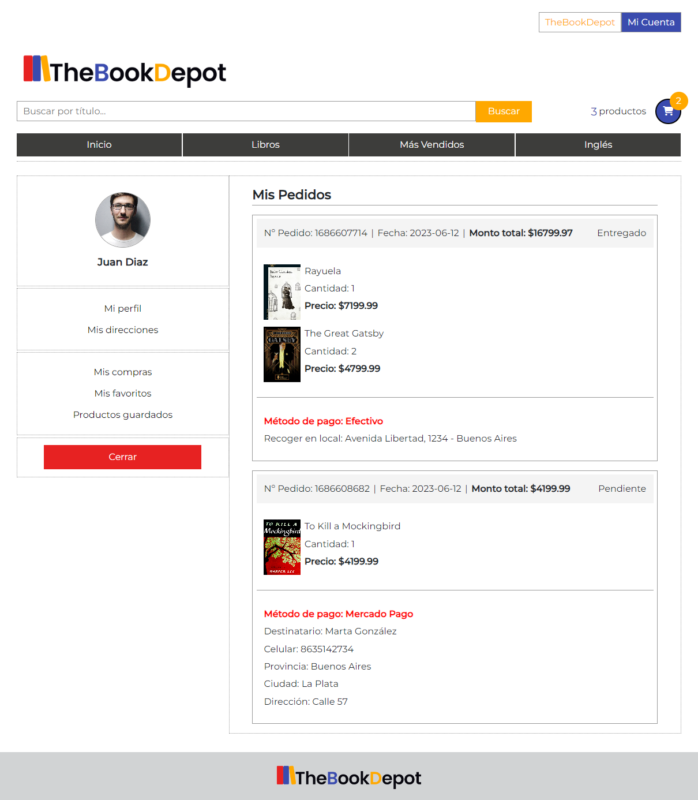

# TheBookDepot 📚

¡Bienvenido/a a TheBookDepot, tu destino en línea para explorar un vasto universo literario de novelas cautivadoras, cómics vibrantes y apasionantes mangas! Nos apasiona el arte de contar historias y nos enorgullece brindar una plataforma que nutre la imaginación y el amor por la lectura.

# Imagenes 🖼️

  
  

    
  

  
  

# Características del Proyecto 📋

## Diseño Responsivo:
El proyecto ha sido desarrollado con un diseño responsivo, lo que garantiza una experiencia de usuario fluida y atractiva en una variedad de dispositivos, incluyendo teléfonos móviles, tabletas y computadoras de escritorio.

## Búsqueda por Título:
Los usuarios pueden realizar búsquedas por título para encontrar fácilmente los libros que desean adquirir. La función de búsqueda por título les permite encontrar rápidamente los libros específicos que están buscando.

## Carrito de Compras:
Se ha implementado un sistema de carrito de compras que permite a los usuarios agregar libros a su carrito y realizar compras de manera sencilla. Los usuarios pueden ver el contenido de su carrito, ajustar las cantidades y finalizar el proceso de compra.

## Pasarela de Pago con Mercado Pago:
La plataforma de pago utilizada en el proyecto es Mercado Pago, una pasarela de pago segura y confiable. Los usuarios pueden realizar transacciones de compra utilizando diferentes métodos de pago aceptados por Mercado Pago, como tarjetas de crédito, débito y transferencias bancarias.

## Autenticación y Autorización con Token:
Se ha implementado un sistema de autenticación y autorización basado en tokens para proteger las rutas y funcionalidades del proyecto. Los usuarios deben autenticarse mediante un token válido para acceder a las funciones protegidas, como realizar compras, gestionar el carrito y acceder a su historial de pedidos.

## Panel de Administrador:
El proyecto cuenta con un panel de administrador que permite a los administradores gestionar el catálogo de libros, agregar nuevos libros, actualizar información y precios, así como gestionar pedidos y usuarios. El panel de administrador ofrece una interfaz intuitiva y segura para realizar estas tareas de manera eficiente.

## Desarrollado con Node.js y React:
El proyecto ha sido desarrollado utilizando Node.js en el backend para la lógica del servidor y React en el frontend para construir la interfaz de usuario interactiva y dinámica. Esta combinación de tecnologías modernas permite un desarrollo ágil y eficiente, así como un rendimiento óptimo del proyecto.